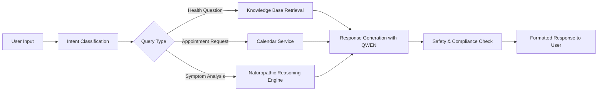

# AI Assistant for Naturopathic Treatment
https://t.me/HeelixAI_Bot

> 🌿 Intelligent conversational assistant for personalized naturopathic care guidance

---

## 📋 Project Overview

**AI Assistant for Naturopathic Treatment** is an innovative healthcare conversational AI designed to support patients and practitioners in the field of natural medicine. The assistant provides evidence-informed naturopathic recommendations, answers health-related questions, and streamlines appointment scheduling — all through an intuitive, empathetic dialogue interface.

### 🎯 Mission
To make personalized, safe, and accessible naturopathic guidance available to anyone seeking holistic health support, while maintaining the highest standards of patient safety and professional collaboration.

---

## ✨ Key Features

### 🤝 Intelligent Dialogue Management
- **Context-aware conversations**: The assistant maintains conversation history to provide coherent, personalized responses
- **Adaptive questioning**: Dynamically asks clarifying questions to gather essential health information
- **Empathetic communication**: Uses a warm, professional tone tailored to the user's emotional state and health literacy level
- **Multilingual support**: Ready for localization to serve diverse patient populations

### 📚 Knowledge Base Q&A System
- **Curated naturopathic knowledge**: Answers questions on:
  - Homeopathy (remedies, potencies, constitutional approaches)
  - Herbal medicine & phytotherapy (herb profiles, preparations, interactions)
  - Traditional Chinese Medicine (Qi Gong, Tai Chi, meridian theory)
  - Therapeutic exercise & movement therapies
  - Nutrition, hydrotherapy, and lifestyle medicine
- **Source transparency**: Cites authoritative references (European Herbal Monographs, homeopathic pharmacopoeias, TCM classics)
- **Safety-first filtering**: Automatically flags contraindications, drug-herb interactions, and red-flag symptoms

### 🗓️ Appointment Scheduling & Calendar Integration
- **Natural language booking**: Patients can schedule consultations using conversational prompts
- **Google Calendar sync**: 
  - Automatic event creation with patient details, session type, and preparation notes
  - Two-way synchronization for rescheduling and cancellations
  - Timezone-aware scheduling for remote consultations
- **Reminder system**: Configurable email/SMS reminders to reduce no-shows
- **Practitioner dashboard**: View, manage, and prioritize upcoming appointments

---

## 🛠️ Technology Stack

| Component | Technology/Service | Purpose |
|-----------|-------------------|---------|
| **LLM Engine** | QWEN (Alibaba Cloud) | Core reasoning, dialogue generation, prompt execution |
| **System Prompt Design** | QWEN | Crafting specialized instructions for naturopathic reasoning, safety protocols, and response formatting |
| **Knowledge Base** | QWEN + Vector Storage | Structured storage and retrieval of naturopathic protocols, herb databases, and clinical guidelines |
| **AI Assistant Platform** | [Suvvy](https://suvvy.ai/) | No-code/low-code environment for assistant orchestration, dialogue flow design, and deployment |
| **Calendar Integration** | Google Calendar API | Secure appointment management and synchronization |
| **Security Layer** | OAuth 2.0, Encryption | HIPAA-aware data handling for patient information |

---

## 🧠 Core AI Architecture



### System Prompt Highlights (Powered by QWEN)
```yaml
Role: Expert Naturopathic AI Consultant
Core Principles:
  - Safety First: Always flag red-flag symptoms and recommend urgent care when needed
  - Personalization: Tailor recommendations to constitution, lifestyle, and goals
  - Transparency: Cite sources and indicate evidence levels
  - Collaboration: Position recommendations as complementary to conventional care

Response Framework:
  1. Analyze complaints → Identify syndromes & root causes
  2. Prioritize interventions: acute support → foundational care → prevention
  3. Structure output: Stage-based protocol with clear instructions
  4. Include: contraindications, expected timeline, monitoring criteria
```

---

## 🔄 User Journey Example

```
Patient: "I've been having trouble sleeping and feel anxious during the day."

🤖 Assistant:
1️⃣ Clarifies: "Thank you for sharing. To help you best, could you tell me:
   - How long have you experienced these symptoms?
   - Do you notice any triggers (stress, caffeine, screen time)?
   - Are you currently taking any medications or supplements?"

2️⃣ After receiving details → Analyzes pattern (e.g., "Liver Qi stagnation with Heart Yin deficiency" in TCM framework)

3️⃣ Provides staged protocol:
   🌿 Stage 1 (Days 1-7): 
      - Herbal tea: Passionflower + Lemon balm (1 cup before bed)
      - Homeopathy: Ignatia 30C, 3 pellets if anxiety spikes
      - Evening routine: 10-min Qi Gong "Calming the Spirit" sequence
   
   🌿 Stage 2 (Weeks 2-4):
      - Adaptogen protocol: Ashwagandha root extract (with contraindication check)
      - Sleep hygiene checklist + digital sunset recommendation
      - Acupressure self-massage guide (HT7, PC6 points)

4️⃣ Offers scheduling: "Would you like to book a 30-minute follow-up consultation to review your progress? I can add it to your Google Calendar."

5️⃣ Adds safety note: "⚠️ If you experience chest pain, severe dizziness, or thoughts of self-harm, please seek immediate medical attention."
```

---

## 🔐 Safety & Compliance Framework

| Risk Category | Mitigation Strategy |
|--------------|---------------------|
| **Medical emergencies** | Red-flag keyword detection → Immediate urgent care recommendation + crisis resources |
| **Contraindications** | Pre-screening questions (pregnancy, medications, chronic conditions) → Filter unsafe recommendations |
| **Misinformation** | Knowledge base sourced from peer-reviewed monographs; uncertainty expressed when evidence is limited |
| **Data privacy** | Minimal data collection; calendar integration uses scoped OAuth permissions; no storage of sensitive health data without consent |
| **Scope boundaries** | Clear disclaimers: "This assistant provides educational support and does not replace diagnosis or treatment by a licensed healthcare provider" |

---

## 📦 Deployment & Integration

### Via Suvvy Platform ([suvvy.ai](https://suvvy.ai/))
- ✅ Visual dialogue flow builder for non-technical team members
- ✅ Built-in testing environment for prompt iteration
- ✅ Analytics dashboard: track user satisfaction, common queries, conversion to appointments
- ✅ Multi-channel deployment: web widget, Telegram, WhatsApp, or embedded in clinic websites

### Google Calendar Integration Setup
```javascript
// Pseudocode: Appointment booking flow
async function scheduleAppointment(patientData, slot) {
  const event = {
    summary: `Naturopathic Consultation - ${patientData.name}`,
    start: { dateTime: slot.start, timeZone: patientData.timezone },
    end: { dateTime: slot.end, timeZone: patientData.timezone },
    attendees: [{ email: patientData.email }],
    reminders: { useDefault: false, overrides: [
      { method: 'email', minutes: 1440 },
      { method: 'popup', minutes: 30 }
    ]},
    description: generatePreVisitInstructions(patientData)
  };
  
  return await google.calendar.events.insert({
    calendarId: 'primary',
    resource: event,
    auth: oauth2Client
  });
}
```

---

## 📈 Success Metrics

| Category | KPI | Target |
|----------|-----|--------|
| **User Engagement** | Avg. conversation length, return rate | >3 turns/session; 40% 7-day retention |
| **Clinical Utility** | % of users reporting "helpful" recommendations | ≥85% satisfaction in post-chat survey |
| **Operational Efficiency** | Appointment booking conversion, no-show reduction | 30% of chats → scheduled visit; 25% fewer no-shows |
| **Safety** | False negative rate on red-flag detection | <0.1% (validated via clinical audit) |

---

## 🚀 Future Roadmap

- [ ] **Phase 2**: Integration with wearable data (sleep trackers, HRV) for personalized lifestyle feedback
- [ ] **Phase 3**: Practitioner portal for protocol customization, patient progress tracking, and outcome reporting
- [ ] **Phase 4**: Multi-assistant orchestration — specialized modules for pediatrics, geriatrics, sports naturopathy
- [ ] **Phase 5**: Clinical validation study in partnership with integrative medicine clinics

---

## 🤝 Contributing & Contact

This project welcomes collaboration with:
- Licensed naturopathic doctors (NDs) and herbalists for knowledge base curation
- AI ethics specialists for safety framework refinement
- Healthcare UX designers for accessibility improvements

🔗 **Demo & Documentation**: [Link to be added]  
📧 **Project Lead**: [Contact information]  
🐙 **Code Repository**: [Private/Enterprise — access upon request]

---

> ⚠️ **Disclaimer**: This AI assistant is designed for educational and supportive purposes only. It does not provide medical diagnosis, treatment, or replace professional healthcare advice. Always consult with a qualified healthcare provider for personal health concerns.

*Last updated: March 2026*  
*Version: 1.0.0*
